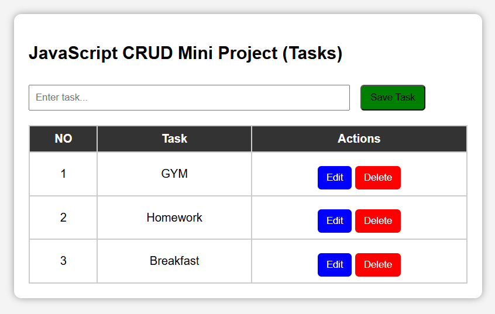

# 📝 JavaScript CRUD Mini Project (Tasks Todo App)

[](https://opensource.org/licenses/MIT)
[](https://developer.mozilla.org/en-US/docs/Web/JavaScript)

## ✨ **Project Description**
Yeh ek **simple Vanilla JavaScript CRUD application** hai jo **Tasks (To-Do List)** manage karta hai. Koi backend ya framework nahi – **pure browser mein chalti hai** (Local Storage future mein add kar sakte ho). 

**CRUD Operations**:
- **Create**: Naya task add karo.
- **Read**: Sab tasks table mein dikhao.
- **Update**: Edit button se modify.
- **Delete**: Delete button se hatao.

**Demo Live**: [https://github.com/Jitendrachaudhari1234/Task_Crud.git) 🎉

## 🚀 **Features**
- ✅ **Add Task**: Input mein type → Save.
- ✅ **View All Tasks**: Auto table update.
- ✅ **Edit Task**: Click Edit → Input fill → Save.
- ✅ **Delete Task**: Click Delete → Gone!
- ✅ **Responsive Design**: Mobile-friendly CSS.
- ✅ **No Dependencies**: Pure HTML/CSS/JS.
- 🔮 **Future**: LocalStorage save, Search/Filter.

## 🛠️ **Tech Stack**
| Tech | Version/Use |
|------|-------------|
| **HTML5** | Structure |
| **CSS3** | Styling (Flex/Grid optional future) |
| **JavaScript (ES6+)** | Logic (Array methods: push, splice, forEach) |
| **Browser APIs** | DOM Manipulation (`innerHTML`, `addEventListener`) |

## 📱 **Screenshots**
### Home Page (Empty)
 
### Tasks Added + Edit/Delete


### Demo GIF
*(Record browser: Loom/ScreenToGif)*


## 🎮 **How to Run (Super Easy!)**
1. **Download/Clone**:
   ```bash
   git clone https://github.com/yourusername/js-crud-todo.git
   cd js-crud-todo